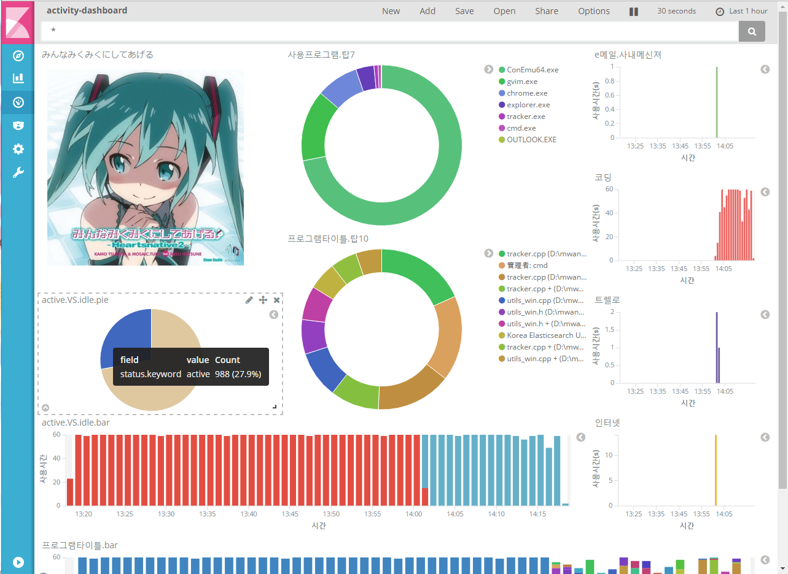

# activity-tracker
> An agent of personal activity monitoring system for Windows desktop.

`activity-tracker`는 포어 그라운드 윈도우상의 활동을 모니터링하여 `Fluentd` 서버로 전송, `Elasticsearch`, `InfluxDB`등의 스토리지에 저장하고 가시화하는 시스템의 에이전트 프로그램입니다. `activity-tracker`가 수집하는 정보는 다음과 같습니다.

* filename: 포어 그라운드 윈도우의 파일명 ex) Diablo III.exe
* window_text: 포어 그라운드 윈도우의 타이틀 ex) 디아블로 III
* action_per_second: 초당 키보드나 마우스 입력의 횟수
* status: 현재 상태
  * 30초 이상 키보드나 마우스 입력이 없을 경우 idle
  * 이외의 경우는 active
* user: 현재 로그인 상태의 윈도우즈 계정

## 컴파일 방법

`Visual Studio`를 이용해 `build` 디렉토리의 솔루션을 빌드합니다.

## 사용예

다음과 같이 `fluentd`의 호스트IP와  UDP 소스의 포트 번호를 지정하여 실행합니다. 전송된 활동 로그를 `Elasticsearch`, `InfluxDB`등의 스토리지에 저장하는 설정에 관해선 `fluentd`의 문서등을 참고해주십시오.

```sh
activity-tracker.exe 192.168.11.5 20039
```

활동 로그를 `Elasticsearch`에 저장하고 `Kibana`를 사용해 가시화하면 다음과 같이 자신의 활동 내용을 가시화 해볼 수 있습니다.




## 풀 리퀘스트

자유롭게 풀 리퀘스트를 생성해주십시오.

## 외부 라이브러리
`activity-tracker`는 다음의 라이브러리들을 사용하고 있습니다. 훌륭한 라이브러리를 만들어준 개발자들에게 감사드립니다.

* [jsoncpp](https://github.com/open-source-parsers/jsoncpp)

## 라이센스
MIT License
